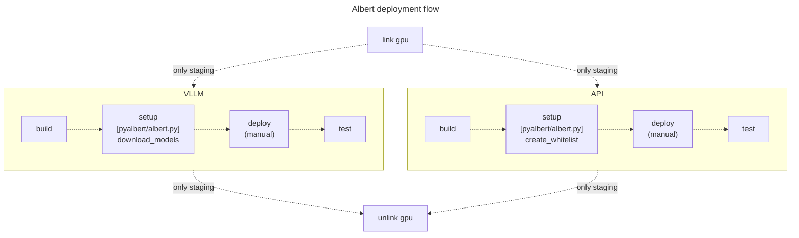

# Déploiement

Le projet Albert est composé de plusieurs services à déployer :
- pyalbert
- models
- api

Pour cela vous devez d'abord disposez d'un environment répondants aux exigences requises ([Requirements](#requirements)). Puis vous disposez de manière de déployer le projet Albert, sans Docker ([Déploiement sans Docker](#déploiement-sans-docker)) ou avec ([Déploiement avec Docker](#déploiement-avec-docker)). **Le projet est conçu pour être déployer dans un pipeline de CI/CD Gitlab avec Docker.**

**Tables des matières**

[[_TOC_]]

## Requirements

Le projet est concçu pour fonctionner sur l'environnement Linux Ubuntu 22.04 LTS. De plus, les packages sont nécessaires :

* jq
* python3.10
* python3.10-venv
* nvidia-driver-535
* nvidia-cuda-toolkit
* nvidia-cuda-toolkit-gcc

*Pour docker :*
* nvidia-container-toolkit
* docker-ce
* docker-ce-cli
* containerd.io
* docker-buildx-plugin
* docker-compose-plugin

Pour un déploiement en production vous pouvez utiliser le script [init_vm.sh](../../utils/init_vm.sh) pour configurer l'environnement nécessaire au projet Albert. Copiez le script sur le serveur et exécutez la commande suivante :

```bash
bash ./init_vm.sh
```

Ce script permet d'installer les packages nécessaires ainsi que de créer un utilisation *gitlab* qui sera nécessaires pour le déploiement de la pipeline de CI/CD. Pour exécuter le script il est nécessaire d'exporter préalablement les variables suivantes :
* `GITLAB_PASSWORD` (mot de passe de l'utilisateur *gitlab*)
* `GITLAB_SSH_PUBLIC_KEY` (clef public qui sera ajouté à l'utilisateur *gitlab*)

## Déploiement sans Docker

* Clonez le repository

	```bash
	git clone git@gitlab.com:etalab-datalab/llm/albert-backend.git albert-backend
	```

* Créez un environnement virtuel python et l'activer

	```bash
	mkdir albert && python3 -m venv albert && source albert/bin/activate
	```

	> ⚠️ Vous devez créer cet environment avec Python 3.10.

### Pyalbert 

* Installez les packages nécessaires

	```bash
	pip install -r albert-backend/pyalbert/requirements.txt
	```

* Ajoutez pyalbert aux librairies de votre environment virtuel

	```bash
	ln -s albert-backend/pyalbert albert/lib/python3.10/site-packages
	```

	> ⚠️ Remplacez la version de Python par celle correspondante à votre environment si celle-ci n'est pas 3.10.

### LLM

* Installez les packages nécessaires

	```bash
	pip install -r albert-backend/api_vllm/requirements.txt
	```

* Configurez les modèles à déployer dans le fichier [llm_routing_table.json](../../pyalbert/config/llm_routing_table.json)

	Pour plus d'information sur comment configurer ce fichier rendez vous sur la documenntation [models.md](../models.md)

* Téléchargez les modèles spécifiez dans le fichier de configuration

	```bash
	python albert-backend/pyalbert/albert.py download_model --storage-dir STORAGE_PATH --env ENV
	```

	> 💡 Remplacez STORAGE_PATH par l'emplacement où vous souhaitez stocker les modèles et ENV par la valeur que vous avez mentionnée dans le fichier de configuration.

#### GPT4All

TO DO


#### VLLM

 * Lancer l'API du modèle

	Pour chaque modèle vous pouvez déployer une API pour intéragir. Commencez par définir l'emplacement des modèles dans une variable *storage_path*.
	
	Puis sélectionner un modèle parmi ceux définit le fichier de configuration :

	```bash
	routing_table=albert-backend/pyalbert/config/llm_routing_table.json
	models=$(jq -r 'keys[]' $routing_table)

	id=$(echo "$models" | sed -n '1p')
	```

	> ⚠️ *1* correspond au l'index du modèle dans le fichier de configuration (ici c'est le premier modèle qui est sélectionné). Remplacez ce chiffre pour sélectionner un autre model

	```bash
    model=$(jq -r '.["'$id'"] | .model' $routing_table)
    port=$(jq -r '.["'$id'"] | .port' $routing_table)
    gpu_mem_use=$(jq -r '.["'$id'"] | .gpu_mem_use' $routing_table)
    tensor_parralel_size=$(jq -r '.["'$id'"] | .tensor_parralel_size' $routing_table)
	model=${storage_path}/${id}

	python albert-backend/api_vllm/app.py --host=0.0.0.0 --port=$port --model=$model --tensor-parallel-size $tensor_parralel_size --gpu-memory-utilization $gpu_mem_use
	```

### API
	
## Installation avec Docker

L'installation avec Docker se fait dans le cadre d'un pipeline de CI/CD Gitlab. Reférez-vous au fichier [.gitlab-ci.yml](../../.gitlab-ci.yml) pour plus d'information sur les étapes de déploiement réalisée. Afin d'exécuter cette pipeline il est nécessaire de configurer au préalable certaines variables d'environnement dans Gitlab. Pour cela rendez vous sur la documentation [environments.md](environments.md).

Les étapes de CI/CD sont décrites schématiquement ici :

