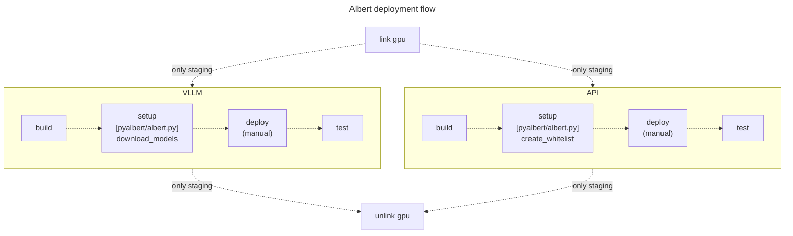

# Déploiement

Le projet Albert est composé de plusieurs services à déployer :
- pyalbert
- llm
- api
- embeddings

Pour cela vous devez d'abord disposer d'un environment répondant aux exigences requises ([Requirements](#requirements)). Puis deux installation sont possibles : sans Docker ([Installation locale (sans Docker)](#installation-locale-sans-docker)) ou avec ([Déploiement en CI/CD (avec Docker)](#déploiement-en-cicd-avec-docker)).

**Tables des matières**

[[_TOC_]]

## Requirements

Le projet est concçu pour fonctionner sur l'environnement Linux Ubuntu 22.04 LTS. De plus, les packages sont nécessaires :

* jq
* python3.10
* python3.10-venv
* nvidia-driver-535
* nvidia-cuda-toolkit
* nvidia-cuda-toolkit-gcc

*Pour docker :*
* nvidia-container-toolkit
* docker-ce
* docker-ce-cli
* containerd.io
* docker-buildx-plugin
* docker-compose-plugin

Pour un déploiement en production vous pouvez utiliser le script [init_vm.sh](../../utils/init_vm.sh) pour configurer l'environnement nécessaire au projet Albert. Copiez le script sur le serveur et exécutez la commande suivante :

```bash
bash ./init_vm.sh
```

Ce script permet d'installer les packages nécessaires ainsi que de créer un utilisateur *gitlab* qui sera nécessaire pour le déploiement de la pipeline de CI/CD. Pour exécuter le script il est nécessaire d'exporter préalablement les variables suivantes :
* `GITLAB_PASSWORD` (mot de passe de l'utilisateur *gitlab*)
* `GITLAB_SSH_PUBLIC_KEY` (clef public qui sera ajouté à l'utilisateur *gitlab*)

## Installation locale (sans Docker)

* Clonez le repository

	```bash
	git clone git@gitlab.com:etalab-datalab/llm/albert-backend.git ~/albert-backend && cd ~/albert-backend
	```

* Créez un environnement virtuel python et l'activer

	```bash
	mkdir ~/albert && python3 -m venv ~/albert && source ~/albert/bin/activate
	```

	> ⚠️ Vous devez créer cet environment avec Python 3.10.

### Pyalbert 

* Installez les packages nécessaires

	```bash
	pip install -r ./pyalbert/requirements.txt
	```

* Ajoutez pyalbert aux librairies de votre environment virtuel

	```bash
	ln -s ./pyalbert albert/lib/python3.10/site-packages
	```

	> ⚠️ Remplacez la version de Python par celle correspondante à votre environment si celle-ci n'est pas 3.10.

### LLM


* Installez les packages nécessaires

	```bash
	pip install -r ./llm/vllm/requirements.txt
	pip install -r ./llm/gpt4all/requirements.txt
	```

* Lancer un modèle

	Le script [launch_local_llm.sh](../../utils/launch_local_llm.sh) permet de télécharger et lancer l'API d'un modèle Albert en une seule ligne de commande. Vous pouvez déployer un modèle avec deux drivers : vllm ou gpt4all. Pour plus d'information, rendez vous sur la documentation [models.md](../models.md) qui détaille la configuration des différents modèles Albert disponibles.
 
	```bash
	bash ./utils/launch_local_llm.sh \
	-s STORAGE_PATH \
	-r HF_REPO_ID \
	-p PORT \
	-d DRIVER
	```

	Par exemple pour lancer [tiny-albert](https://huggingface.co/AgentPublic/tiny-albert) :

	```bash
	bash ./utils/launch_local_llm.sh -s ~/models -r AgentPublic/tiny-albert -d gpt4all -p 8000 -m ggml-model-expert-q4_K.bin
	```

	Ou encore pour lancer [albert-light](https://huggingface.co/AgentPublic/albert-light) :

	```bash
	bash ./utils/launch_local_llm.sh -s ~/models -r AgentPublic/albert-light -d vllm -p 8000
	```

### Reverse proxy (Nginx)

* Installez Nginx

	```bash
	sudo apt install nginx
	```

* Configurez Nginx pour rediriger les requêtes vers l'API, activez le vhost et redémarrez Nginx:

	```bash
	sudo cp ./contrib/nginx/albert.conf /etc/nginx/sites-available/albert.conf
	sudo ln -s /etc/nginx/sites-available/albert /etc/nginx/sites-enabled
	sudo systemctl restart nginx
	```

* Installez certbot

	```bash
	sudo apt install certbot python3-certbot-nginx
	```

* Créez un certificat SSL pour votre domaine

	```bash
	sudo certbot --nginx -d mondomaine.com
	```

	Vous pouvez ensuite vérifier que le certificat a été correctement installé en regardant si le fichier `/etc/nginx/sites-available/albert.conf` a bien été modifié:
	```bash
	cat /etc/nginx/sites-available/albert.conf
	```

* Optionnel : installez et configurez le firewall pour Nginx

	```bash
	sudo apt install ufw
	sudo ufw allow 'Nginx Full'
	sudo ufw allow ssh # très important! pour conserver sa connection ssh
	sudo ufw enable
	```

* Optionnel : n'oubliez pas d'installer et d'activer fail2ban

	```bash
	sudo apt install fail2ban
	sudo systemctl start fail2ban # pour le démarrer
	sudo systemctl enable fail2ban # pour le démarrer au démarrage
	```

### Databases

* Créer un fichier de variable d'environnement avec les variables suivantes :

	* `POSTGRES_PASSWORD`
    * `POSTGRES_PORT`
    * `ELASTIC_PASSWORD`
  	* `ELASTIC_PORT`
    * `QDRANT_REST_PORT`
	* `QDRANT_GRPC_PORT`
    * `COMPOSE_FILE`
    * `COMPOSE_PROJECT_NAME`

	Pour plus d'informations sur la valeur des variables voir la documentation dédiées [environments.md](environments.md).

	Les variables `COMPOSE_FILE` et `COMPOSE_PROJECT_NAME` sont des variables prédéfinies par Docker, pour plus d'information voir la [documentation officielle]( https://docs.docker.com/compose/environment-variables/envvars/).


* Déployer les bases de données

	```bash
	docker compose --env-file=PATH_TO_ENV_FILE down && docker compose --env-file=PATH_TO_ENV_FILE up --detach
	```

### RAG

> Par défaut les fichiers téléchargés et générés dans cette section seront mis dans un dossier *./_data*.

* Pour activer la fonctionnalité de RAG, vous devez tout d'abord téléchargez les documents qui vont alimenter le système : 

	```bash
    python3 ./pyalbert.py download_corpus
	```

* Vous devez ensuite appliquer un preprocessing sur ces documents : 

	```bash
    python3 ./pyalbert.py make_chunks --structured
	```

* Puis, vous devez créer des vecteurs à l'aide d'un modèle d'embeddings 

	```bash
    python3 ./pyalbert.py make_embeddings
	```

* Enfin vous devez intégrer les documents et ces vectors dans les bases de données dédiés qui ont été déployées dans la section précédente

	```bash
    # Elasticsearch indexes
    python3 ./pyalbert.py index experiences --index-type bm25
    python3 ./pyalbert.py index sheets --index-type bm25
    python3 ./pyalbert.py index chunks --index-type bm25

    # Qdrant indexes (aka collections)
    python3 ./pyalbert.py index experiences --index-type e5
    python3 ./pyalbert.py index chunks --index-type e5
	```

### API

#### Avec docker

* Exportez les variables d'environnement suivantes :

	* `API_PORT`
	* `LLM_TABLE`
	* `API_URL`
	* `FRONT_URL`
	* `POSTGRES_PASSWORD`
    * `POSTGRES_PORT`
    * `POSTGRES_HOST`

	Exportez également les variables suivantes pour spécifier où trouver les bases de données nécessaires au RAG : 

	* `ELASTIC_HOST`
  	* `ELASTIC_PORT`
	* `ELASTIC_PASSWORD`
	* `QDRANT_HOST`
    * `QDRANT_REST_PORT`
	* `QDRANT_GRPC_PORT`

* Déployé un container d'API : 
	
	```bash
    docker run --gpus all -it --publish ${API_PORT}:8090 --restart always --name albert-api-v2 \
    --env POSTGRES_HOST=${POSTGRES_HOST} \
    --env POSTGRES_PORT=${POSTGRES_PORT} \
    --env POSTGRES_PASSWORD=${POSTGRES_PASSWORD} \
    --env QDRANT_HOST=${QDRANT_HOST} \
    --env QDRANT_REST_PORT=${QDRANT_REST_PORT} \
    --env QDRANT_GRPC_PORT=${QDRANT_GRPC_PORT} \
    --env ELASTIC_HOST=${ELASTIC_HOST} \
    --env ELASTIC_PORT=${ELASTIC_PORT} \
    --env API_URL=${CI_DEPLOY_URL} \
    --env FRONT_URL=${CI_DEPLOY_URL} \
    --env "LLM_TABLE=${LLM_TABLE}" \
    ${CI_REGISTRY_IMAGE}/api:${CI_API_IMAGE_TAG}
	```

## Installation avec Docker

L'installation avec Docker se fait dans le cadre d'un pipeline de CI/CD Gitlab. Reférez-vous au fichier [.gitlab-ci.yml](../../.gitlab-ci.yml) pour plus d'information sur les étapes de déploiement réalisée. Afin d'exécuter cette pipeline il est nécessaire de configurer au préalable certaines variables d'environnement dans Gitlab. Pour cela rendez vous sur la documentation [environments.md](environments.md).

Les étapes de CI/CD (dupliquées pour chaque environnement) sont décrites schématiquement ici :



* Configurez les modèles à déployer dans le fichier [llm_routing_table.json](../../pyalbert/config/llm_routing_table.json)

	Pour plus d'information sur comment configurer ce fichier, rendez vous sur la documentation [models.md](../models.md) qui détaille la configuration des différents modèles disponibles.

* Téléchargez les modèles spécifiez dans le fichier de configuration

	```bash
	python albert-backend/pyalbert/albert.py download_model --storage-dir=STORAGE_PATH --hf-repo-id=
	```

	> 💡 Remplacez STORAGE_PATH par l'emplacement où vous souhaitez stocker les modèles et ENV par la valeur que vous avez mentionnée dans le fichier de configuration.
