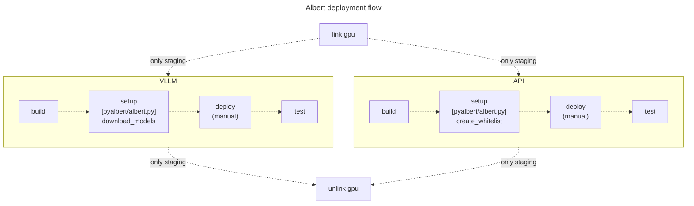

# CI/CD

```mermaid
---
title: "Albert deployment flow"
---
graph TD

subgraph VLLM["VLLM"]
    job_vllm_build["build"]
    -.-> job_vllm_setup["setup\n[pyalbert/albert.py]\ndownload_models"]
    -.-> job_vllm_deploy["deploy\n(manual)"]
    -.-> job_vllm_test["test"]
end

subgraph API["API"]
    job_api_build["build"]
    -.-> job_api_setup["setup\n[pyalbert/albert.py]\ncreate_whitelist"]
    -.-> job_api_deploy["deploy\n(manual)"]
    -.-> job_api_test["test"]

end

job_pre["link gpu"]
job_post["unlink gpu"]

job_pre -.-> |"only staging"| VLLM
job_pre -.-> |"only staging"| API
VLLM -.-> |"only staging"| job_post
API -.-> |"only staging"| job_post
```