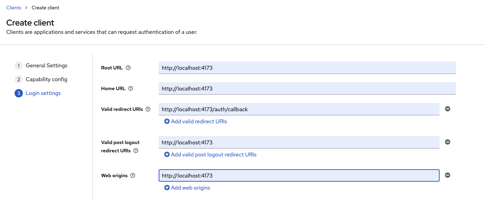

## Instructions Étape par Étape pour Initialiser Keycloak

#### 1. Configuration de Docker Compose
   - Assurez-vous d'avoir Docker et Docker Compose installés.
   - Utilisez un fichier `docker-compose.yml` pour configurer Keycloak et la base de données.

#### 2. Créer un Client
   - Utilisez le realm master ou créez un nouveau realm et un utilisateur admin.
   - Naviguez jusqu'à la section Clients dans la console d'administration de Keycloak.
   - Créez un nouveau client ou sélectionnez-en un existant.
   - Réglez **`Client authentication`** sur **ON**.

   

#### 3. Récupérer la Clé Secrète du Client
   - Allez dans l'onglet `Credentials` du client.
   - Copiez la clé secrète du client.
   - Mettez à jour votre fichier `.env` avec la clé secrète du client dans le dossier `pyalbert`.

Pour des informations supplémentaires sur la configuration, consultez ce [post Stack Overflow](https://stackoverflow.com/questions/44752273/do-keycloak-clients-have-a-client-secret).